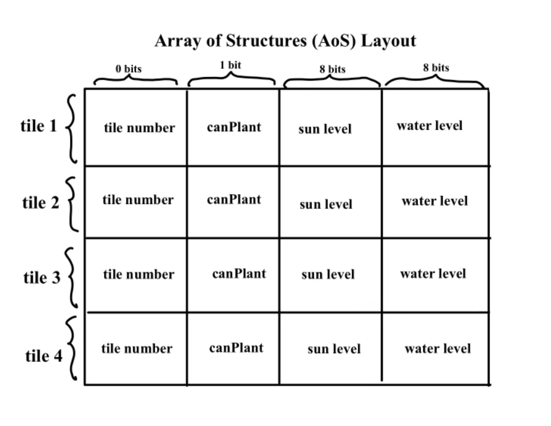

# F2. Devlog Entry - [12/02/2024]  
## How we satisfied the software requirements
### F0+F1
 Everything that we implimented to satisfy the F0 and F1 software requirements have stayed consistent. Thus, the requirements are met using what we created last week. The game still has the same tile structure, gameplay, and the autosave/manual save both still work as they did last week. 

### [F2.a] External DSL for Scenario Design
For our external DSL design we decided to based it on YAML. Our design is pretty simple in that it takes in the grid size, available plants, win conditions, and human instructions. 

Example Scenario: 
```# Defines the dimensions of the playable grid
grid_size:
  - 50  # Width of the grid
  - 50  # Height of the grid

# Lists the types of plants that can be grown in this scenario
available_plants:
  - redshroom, cactus, snowtree  # Plant types available to the player

# Specifies the victory requirements
win_conditions:
  - - any  # Any type of plant is acceptable to meet the goal
    - min  # Minimum requirement for the next value
    - 10   # At least 10 plants must be grown to win

# Provides plain language instructions for the player
human_instructions: grow at least 10 plants
```
Natural Language Translation:
* grid_size: Defines the dimensions of the playable grid. In this example, the grid is 50x50 units.
* available_plants: Lists the types of plants that can be grown in this scenario. Here, the options are "redshroom," "cactus," and "snowtree."
* win_conditions: Specifies the victory requirements.
any indicates that any type of plant is acceptable to meet the goal.
* min sets the minimum number of plants required to win the scenario, which is 10 in this case.
* human_instructions: Provides plain language guidance for the player. In this example, the objective is to "grow at least 10 plants."

### [F2.b]  Internal DSL for Plants and Growth Conditions
Our internal DSL is built with JavaScript using the Phaser framework. It simplifies gameplay mechanics like plant generation, state management, and win conditions. Players can create random plants (e.g.redShroom, cactus, or snowTree) using a PlantBuilder to configure growth and environmental needs. The DSL also enables features like undo/redo with simple calls to addState and loadState. By embedding the DSL in the host language, we can directly access the engine features without the complexity of parsing external formats. 

Code Snippet: 
```
/* ... */
// Planting random plant
if (Phaser.Input.Keyboard.JustDown(this.plant)) {
  const plantTypes = [redShroom, cactus, snowTree];
  const PlantClass = plantTypes[Math.floor(Math.random() * plantTypes.length)];
  const newPlant = new PlantClass();
  new PlantBuilder(newPlant)
    .setGrowthLevel(3)
    .setMoistureRequired(2)
    .setSunRequired(2)
    .setGrownImage(PlantClass.imageID);

  const position = getPlayerTileAttributes(this.player);
  const planted = newPlant.plant(this, position[1], position[0]);

  if (planted) {
    this.plants.push(planted);
    addState(this, this.undoStack); // Save the state for undo
    this.redoStack = []; // Clear redo stack after a new action
  }
}

// Undo the last action -> Undo Functionality 
undoButton.on("pointerdown", () => {
  const previousState = this.undoStack.pop();
  if (previousState) {
    this.redoStack.push(previousState);
    loadState(this, previousState); // Restore the previous game state
  }
});
/* ... */
```

Natural Language Explanation:
* Planting a Random Plant:
When the player presses the plant button, a random plant type (redShroom, cactus, or snowTree) is selected.
A PlantBuilder object customizes the plant’s growth level, moisture, and sunlight requirements before placing it on the map at the player’s current position.
The planted object is added to the game’s list of plants, and the game’s state is saved to allow undoing the action later.

* Undo Functionality:
The undo button allows players to revert their last action by restoring the previous state from the undo stack.
After undoing, the reverted state is saved to the redo stack, enabling players to redo actions if needed.

### [F2.c] Switch to Alternate Platform
We ported our project from TypeScript to JavaScript by changing the file types in our development environment and refactoring the code based on the errors in our console. Luckily most of our porting just involved simplifying the code by removing type annotations which still allowed us to preserve functionality. Our alternate platform did not changed. The concepts that needed to be restructured were TypeScript’s type annotations that occured in places like our Plant class. It just needed to be replaced with careful variable initialization and runtime checks in JavaScript so that the code maintains the same functionality. 

Porting Examples: 
* The TypeScript function function generateAttributes(tile: Tile): void was simplified to function generateAttributes(tile) in JavaScript, relying on dynamic typing:

TypeScript:
```
function generateAttributes(tile: Tile): void {
    tile.sunLevel = Math.floor(Math.random() * 5);
}
```
JavaScript:
```
function generateAttributes(tile) {
    tile.sunLevel = Math.floor(Math.random() * 5);
}
```
* Classes like Plant transferred seamlessly, requiring only the removal of TypeScript-specific modifiers like private and public:

TypeScript:
```
export class Plant {
    private growthLevel: number = 0;
}
``` 
JavaScript:
```
export class Plant {
    constructor() {
        this.growthLevel = 0;
    }
}
```
## Reflection
Looking back at our new F2 requirements, our teams plan hasn't changed much except for the new implementation of the internal and external DSL's. It definitely forced us to restructure our code so that the program is much more organized and takes in more specific inputs. The switch from TypeScript to JavaScript did help simplify our development process by removing the need for compilation and type definitions. It allowed for quicker iteration and testing. At this point, we haven't reconsidered our tools and materials described. We still are using Perlin noise for our map generation. For our roles, we alternate our tasks throughout the week so we haven't been strictly following the role assignments. In terms of game design evolution, we are looking into adding more visual stages of growth for our plants to make it easier to for players to understand when the plants can be harvested. 

# F1. Devlog Entry - [11/27/2024]  
## How we satisfied the software requirements
### [F0] Everything that we implimented to satisfy the F0 software requirements have stayed consistent. Thus, the requirements are met using what we created last week.

### [F1.a] Game is stored in a grid state as our grid is made of tile objects. 
  * The games grid is backed by a contiguous byte array in an AoS format as each tile is treated as an object with grouped attributes.

  

### [F1.b] Player can manually save their game progress by clicking on the "Save Game" button. 
  * Once "Save Game" button is clicked, game is saved by downloading JSON file of game state in players browser. Important game state data such as player location, inventory, and the entire map is formated in a AoS in the JSON file. If the player wishes to load the save file, they simply have to press load and select the save file.

### [F1.c] Game automatically saves state of game every 2 mins. Player is prompted with request of downloading multiple files upon opening game. It gets saved among the manual save entries. 
  * A JSON file of game is automatically downloaded into the players browser saving game state every 2 mins. 

### [F1.d] The player is able to undo every major choice. 
  * New game state gets loaded once undo is selected. 

## Reflection: 
Looking back at our new F1 requirements, our teams plan hasn't changed much except for the new implementation of saving game states. With our usage of Perlin Noise, we were able to have our grid be set up of tile objects and it make AoS format and byte array storage requirement work in our favor. In terms of the new game state implementation we structured it so we can build on top of our existing workflow. Originally, we were going to use JSON files in conjuction with "Tiled" to create and save our map. But, due to the fact that we have changed from a "Tiled" created map to a Perlin noise PCG map, our use of JSON files, while still in line with saving the game state, has been inplimented to fit the way our PCG map is created (i.e. using our "Tile" structure).

# F0. Devlog Entry - [11/22/2024]  

## How we satisfied the software requirements
### [F0.a]: You control a character moving over a 2D grid.
  * Using Perlin noise, a procedurally generated 2D map is created out of dirt, sand, or snow tiles. The player can continuously control a character using WASD over the 2D grid of tiles.

### [F0.b]: You advance time manually in the turn-based simulation.
  * The player clicks the Advance Time button to move on to the next turn.

### [F0.c]: You can reap or sow plants on grid cells only when you are near them.
  * Using the space button, the player can only sow plants on the tile they are positioned on top of. Additionally, players can reap/harvest a fully grown plant from a distance by clicking with their mouse cursor.

### [F0.d]: Grid cells have sun and water levels. The incoming sun and water for each cell is somehow randomly generated each turn. Sun energy cannot be stored in a cell (it is used immediately or lost) while water moisture can be slowly accumulated over several turns.
  * The sun and water level of a cell is determined when the player advances time via the "Advance Time" button.

### [F0.e]: Each plant on the grid has a distinct type (e.g. one of 3 species) and a growth level (e.g. “level 1”, “level 2”, “level 3”).
  * There are three plants: mushrooms, trees, and cacti. They share the same sprite for levels 1 and 2, but once they reach full maturity (i.e. level 3) they will sprout into their distinct plant type.

### [F0.f]: Simple spatial rules govern plant growth based on sun, water, and nearby plants (growth is unlocked by satisfying conditions).
  * The sun and water levels of the tile determine if the plant progresses in the growth stage (i.e. if they were greater or equal to 3 and 2 respectively).

### [F0.g]: A play scenario is completed when some condition is satisfied (e.g. at least X plants at growth level Y or above).
  * The player "wins" when they have harvested 10 plants.

## Reflection
We had a bit of trouble setting up our work environment, especially with figuring out how to let files have access to the Phaser class. We did not utilize Tiled to make the map because we used Perlin Noise for generation. We do not utilize JSON yet as we do not have any sort of save function implemented.

# Devlog Entry - [11/13/2024]

## Intro: The Team
- **Tools Lead**: Jacky and Kenny
- **Engine Lead**: Ethan and Jasmine
- **Design Lead**: Ethan

## Tools and Materials
We have selected the following tools and materials for our project:

- **Game Engine**: **Phaser**  
  We chose Phaser as our game engine because it is an open-source, 2D game framework built with JavaScript and TypeScript. Phaser has many built-in functions and libraries that can help create games that may rely on a lot of visual effects and physics-based interactions. Our team is already familiar with Phaser from previous projects, and its extensive documentation and active community made it an obvious choice for the engine. We also have a good amount of experience in prototyping in Phaser, which will allow us to iterate on ideas quickly and effectively.

- **Libraries**: **Noise Library**  
  In order to implement some sort of procedural generation into our game, we will be using a Noise Library in order to gain access to things such as Perlin and Simplex noise.

- **Programming Languages**: **TypeScript & JSON**  
  For programming languages, we will primarily use TypeScript, as it provides type safety and is highly compatible with Phaser. It is also very compatible with the object-oriented programming used in games. As for data languages, we will use JSON to store and manage game data. JSON will be used as a way to store level data and player data.

- **Tools**: **Visual Studio Code & Tiled**
  We will be using Visual Studio Code as our IDE because it is simply what we all use and are comfortable with. Additionally, VS Code has many useful plugins and features that will help streamline our development process. For map design, we will use Tiled, a versatile map editor that integrates well with Phaser. We have used Tiled in the past and find it effective for creating tiled-based game maps.

- **Alternate Platform**: **Javascript**
  For our alternate platform, we will be transitioning from TypeScript to JavaScript.

## Outlook
Our team is hoping to accomplish integrating some form of procedural content generation in our game in order to make it feel fresh and unpredictable. We aim to create a game world that dynamically responds to player actions, ensuring that no two playthroughs feel the same. By utilizing tools like the Noise Library and Phaser, we expect to develop a game environment that evolves and surprises the player.

We anticipate that implementing procedural generation and ensuring that it integrates smoothly with our game’s mechanics will be the most challenging aspect of the project. Balancing randomness and creating a compelling yet consistent experience will require careful tuning. Unpredictable player actions may also lead to unforseen challenges and bugs. Additionally, transitioning from TypeScript to JavaScript may introduce some technical hurdles as we adapt our codebase to the new environment.

## F0 Software Requirements: 
[F0.a] You control a character moving over a 2D grid.
[F0.b] You advance time manually in the turn-based simulation.
[F0.c] You can reap or sow plants on grid cells only when you are near them.
[F0.d] Grid cells have sun and water levels. The incoming sun and water for each cell is somehow randomly generated each turn. Sun energy cannot be stored in a cell (it is used immediately or lost) while water moisture can be slowly accumulated over several turns.
[F0.e] Each plant on the grid has a distinct type (e.g. one of 3 species) and a growth level (e.g. “level 1”, “level 2”, “level 3”).
[F0.f] Simple spatial rules govern plant growth based on sun, water, and nearby plants (growth is unlocked by satisfying conditions).
[F0.g] A play scenario is completed when some condition is satisfied (e.g. at least X plants at growth level Y or above).
